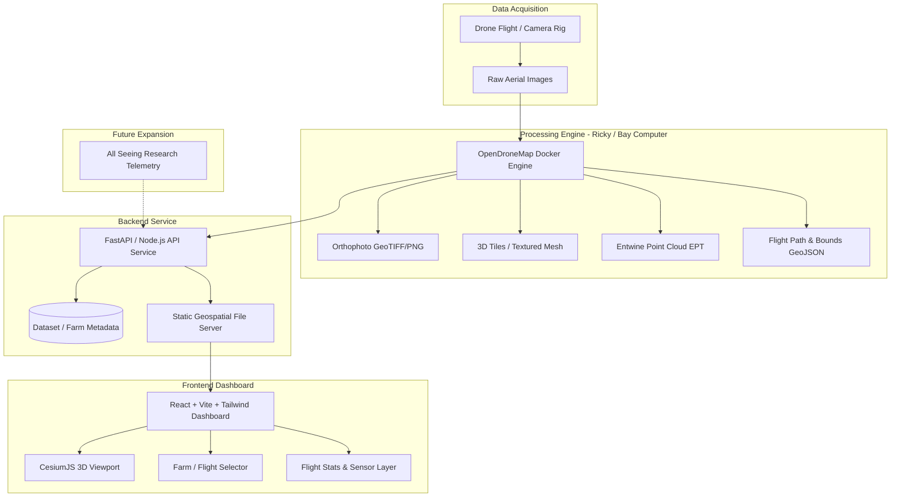

# Project Proposal & Implementation Roadmap: ODM 3D Mapping (Digital Twin)

**Prepared for:** Programming Leads (Zach & Matthew)  
**Date:** September 14, 2026  
**Status:** Awaiting Technical Stack & Roadmap Approval  

---

## 1. Executive Summary

The goal of this project is to build an interactive, web-based **Digital Twin Dashboard** that ingests aerial drone photography, processes the imagery into 3D models and orthophotos using **OpenDroneMap (ODM)**, and renders the georeferenced spatial data in a browser-based 3D environment. 

In addition to visual inspection, the platform is structured to support future expansion—specifically integrating agricultural telemetry and sensor streams from **All Seeing Research** so farmers can monitor their entire property from a unified dashboard.

---

## 2. Recommended Software Stack & Justification

The requirements document called for researching frontend 3D rendering engines (**CesiumJS vs. Three.js**) and determining the software stack for lead approval.

### 2.1 3D Engine Decision: CesiumJS (Primary) vs. Three.js

| Evaluation Metric | **CesiumJS (Recommended)** | **Three.js** |
| :--- | :--- | :--- |
| **Geospatial Coordinate Handling** | **Native WGS84 & UTM support.** Correctly places models, drone flights, and bounds on the globe. | **Manual matrix transformations.** Requires writing custom coordinate normalization and georeferencing logic. |
| **ODM Output Compatibility** | **Native OGC 3D Tiles support** (`--3d-tiles` in ODM) and GeoJSON vector overlays. | Requires converting point clouds/tiles into GLTF/GLB or custom WebGL shaders. |
| **Layer Composition** | Out-of-the-box support for base satellite maps, terrain, orthophoto overlays, and drone flight paths. | Requires manually building tile loaders, lighting setups, skyboxes, and terrain projection shaders. |
| **Measurement & Spatial Tools** | Built-in GIS camera controls, distance/area measurement primitives, and ellipsoid clamping. | Must be implemented from scratch using raycasting. |

**Recommendation:** Use **CesiumJS** as the core geospatial 3D engine for the dashboard. If high-density raw point-cloud inspection is required before mesh generation, pair it with **Potree** or the Cesium 3D Tiles point cloud loader.

### 2.2 Complete System Architecture



* **Frontend:** React + Vite + Tailwind CSS + CesiumJS (`resium` or native CesiumJS API).
* **Backend / File Server:** Python (FastAPI) or Node.js Express service for file streaming, metadata indexing, and kicking off ODM background jobs.
* **Processing Host:** Dockerized OpenDroneMap running on the team workstation ("Ricky" / Bay Computer).

---

## 3. Analysis of Existing Test Data (Callis Road Dataset)

An audit of the existing dataset (`Callis-Road175-9-4-2026-all`) confirms:
* **Point Cloud:** 376,941 reconstructed points stored in Entwine Point Tile format (`ept.json`), georeferenced in **UTM Zone 15N (WGS84)**.
* **Camera Trajectory:** 393 camera shots mapped in `shots.geojson`.
* **Orthophoto:** High-resolution orthomosaic generated (`odm_orthophoto.tfw` and PNG format).
* **Key Finding for Future Processing:** The test dataset ran with `fast_orthophoto: True`, which automatically toggled `--skip-3dmodel`. For full 3D digital twins, the pipeline command will be standardized with `--3d-tiles` and mesh reconstruction enabled.

---

## 4. Phased Implementation Steps & Milestones

Following the structure in the project requirements, work is organized across three parallel tracks: **OpenDroneMap Pipeline**, **3D Viewer**, and **Dashboard Application**.

### Phase 1: Environment Setup & Stack Approval (Week 1)
- [ ] **Step 1.1:** Present this technical proposal to Zach and Matthew for stack sign-off.
- [ ] **Step 1.2:** Configure Docker and test OpenDroneMap (`opendronemap/odm`) on Ricky (Bay Computer) and developer machines.
- [ ] **Step 1.3:** Set up Git repository structure (`/frontend`, `/backend`, `/pipeline`, `/docs`).

### Phase 2: 3D Viewer & Callis Road Ingestion Prototype (Weeks 2–3)
- [ ] **Step 2.1:** Scaffold a Vite + React web application with CesiumJS.
- [ ] **Step 2.2:** Load the Callis Road georeferenced boundary (`odm_georeferenced_model.bounds.geojson`) and center camera view automatically.
- [ ] **Step 2.3:** Drape the Callis Road orthophoto (`Callis-Road-9-4-2026-orthophoto.png`) onto the terrain surface.
- [ ] **Step 2.4:** Render the 393 camera shot poses (`shots.geojson`) as an interactive flight trajectory layer with click-to-view shot details.
- [ ] **Step 2.5:** Integrate 3D point cloud / 3D tiles rendering into the Cesium scene.

### Phase 3: Dashboard Skeleton & Interactive Controls (Weeks 3–4)
- [ ] **Step 3.1:** Implement UI layout: collapsible sidebar, dataset selector, layer manager, and camera control panel.
- [ ] **Step 3.2:** Add dedicated camera modes and speed controls (Top-down 2D Inspection, Drone Orbit, First-Person / Walk mode).
- [ ] **Step 3.3:** Add basic GIS measurement tools (distance measurement, elevation sampler, area calculation).
- [ ] **Step 3.4:** Display flight statistics panel (surface area, ground sampling distance, image count, processing duration).

### Phase 4: Automated OpenDroneMap Pipeline Script (Weeks 4–5)
- [ ] **Step 4.1:** Write a Python CLI automation script (`process_flight.py`):
  * Ingests a directory of raw drone images.
  * Runs the standardized ODM Docker pipeline:
    ```bash
    docker run -ti --rm -v /path/to/images:/code/images -v /path/to/project:/code/odm_orthophoto opendronemap/odm \
      --project-path /code \
      --dsm \
      --pc-ept \
      --3d-tiles \
      --mesh-size 300000 \
      --feature-quality high
    ```
  * Extracts web-ready assets (`3d_tiles/`, `shots.geojson`, bounds, orthophoto, stats).
  * Generates a dataset catalog entry (`metadata.json`).
- [ ] **Step 4.2:** Test the script end-to-end on new flight datasets or ODLC benchmark images.

### Phase 5: Multi-Dataset Selection & All Seeing Research Extensibility (Weeks 5–6)
- [ ] **Step 5.1:** Implement farm/flight selection logic in the dashboard to switch between multiple surveyed dates or fields.
- [ ] **Step 5.2:** Design an extensible schema for All Seeing Research data (soil sensors, weather stations, crop health indices).
- [ ] **Step 5.3:** Create mock telemetry pins over the 3D model demonstrating real-time sensor popups.
- [ ] **Step 5.4:** Perform end-to-end testing, documentation, and handover demo to leads.

---

## 5. Specific Approvals Requested from Leads

To begin active implementation, the following decisions are requested from Zach and Matthew:
1. **Frontend Engine Approval:** Approval to proceed with **CesiumJS** (as opposed to raw Three.js) for geospatial fidelity.
2. **Compute & Docker Access:** Confirmation of access and permissions to run Dockerized ODM on Ricky (Bay Computer).
3. **Repository Setup:** Authorization to initialize the project repository under the team GitHub organization.
